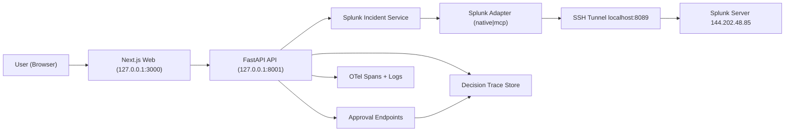

# System Design Flow (AgenticOps)

## End-to-End Runtime Flow

## What Goes In / What Comes Out

### Inputs

- Splunk events from `index=tutorial`
- Analyst interaction:
  - open incident
  - approve/reject decision

### Processing

- Incident list query (aggregated by incident identifier)
- Incident detail query (event sample + inferred probable cause)
- Policy/approval gate checks

### Outputs

- Incident summaries (`/api/v1/incidents`)
- Decision trace detail (`/api/v1/decision-traces/{id}`)
- Approval event ledger (`POST/GET approvals`)
- UI panels: timeline, assessment, confidence, gate

## Data Contracts (Stable Interfaces)

- Adapter methods:
  - `list_indexes()`
  - `run_search(query, earliest, latest)`
  - `get_server_info()`
  - `explain_error(...)`
- API methods:
  - `GET /api/v1/incidents`
  - `GET /api/v1/decision-traces/{workflow_id}`
  - `POST /api/v1/decision-traces/{workflow_id}/approvals`
  - `GET /api/v1/decision-traces/{workflow_id}/approvals`

## Deployment Modes

- `Mock mode`: fixture-backed UI and tests.
- `Live native mode`: Splunk REST `/services/search/jobs/export`.
- `Live MCP mode`: custom `/services/mcp/*` routes if app installed.

## Why This Design

- Adapter boundary isolates Splunk protocol differences.
- UI contract remains unchanged across backends.
- Human-in-the-loop decision gate is enforceable and auditable.
