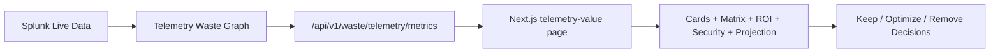
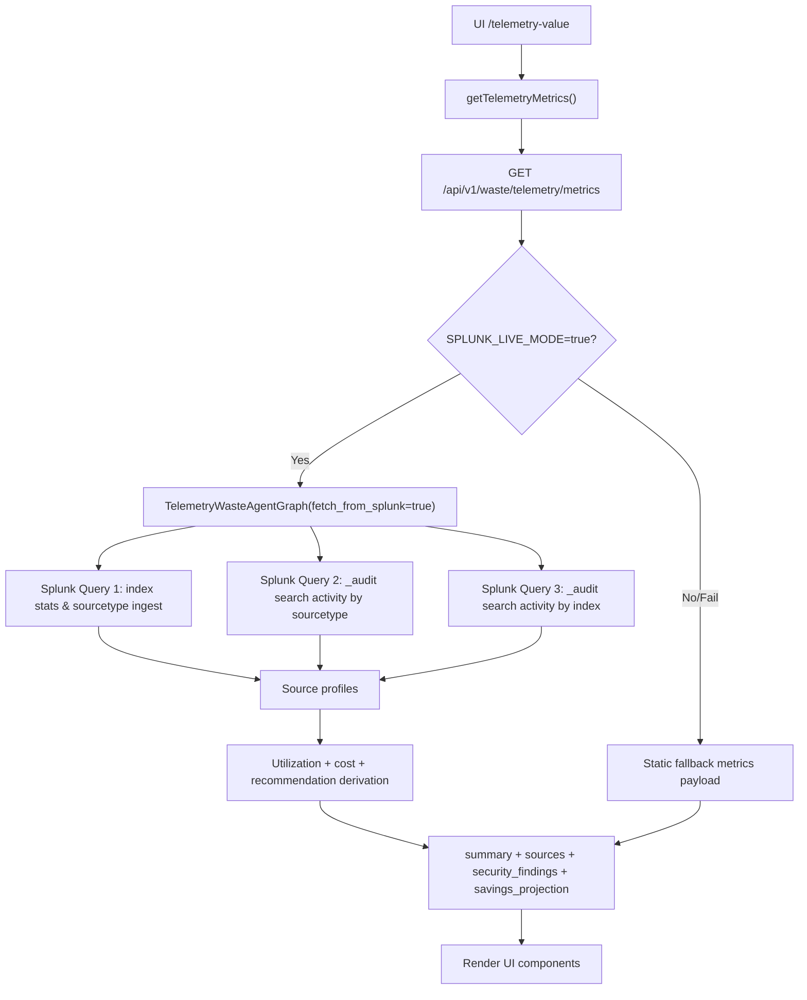

# Telemetry Value Metrics — 15 Minute Demo Playbook

Last verified from live API: 2026-04-22 (local API at `http://127.0.0.1:8001/api/v1/waste/telemetry/metrics`)
Route to demo in UI: `http://127.0.0.1:3000/telemetry-value`

## 1) 15-Minute Agenda (what to say and show)

1. Minute 0-2: Problem + backstory
- "Teams ingest large Splunk volume, but a big portion is low-usage or unused."
- "Telemetry Value Metrics identifies spend, optimization opportunities, and security impact from live Splunk behavior."

2. Minute 2-5: High-level architecture
- Show how Splunk data becomes business metrics in one page.

3. Minute 5-10: Walk the page section-by-section with current values
- Overview cards
- Source analysis cards + matrix
- Annual spend & savings
- Security gaps
- 12-month trajectory
- Recommended actions

4. Minute 10-13: Low-level system design truth
- Exact formulas, thresholds, fallback behavior, and what is AI vs deterministic.

5. Minute 13-15: Business takeaway + Q&A
- "This helps prioritize what to keep, optimize, or remove and quantifies impact in dollars."

---

## 2) Backstory (demo narrative)

Use this exact narrative:

"Most Splunk programs optimize detections first, but cost/value drift grows silently. Telemetry Value Metrics gives a business-first lens: where spend is high, where utilization is low, and what optimization saves annually without reducing operational visibility. This page is generated from live Splunk ingest + search usage patterns, then mapped into ROI and action recommendations."

---

## 3) High-Level Flow (for non-technical audience)



Message to audience:
- "Input is live Splunk behavior."
- "Output is business metrics + optimization actions."

---

## 4) Low-Level System Design (for technical audience)



### Splunk adapter mode
- `SPLUNK_ADAPTER_MODE=auto|mcp|native`
- auto resolves by base URL pattern (`/services/mcp` -> MCP, else native)

---

## 5) Current Live Values (from latest API response)

### Overview
- Total Annual Spend: **$109.25**
- Potential Savings: **$2.42**
- Avg Utilization Score: **25%**
- Security Gaps Found: **4**
- Recommendation Complexity: **Low**

### Top sources seen in payload
1. `gws:reports:drive` (`gsuite`)
- Daily ingest: `0.001 GB`
- Utilization: `34`
- Annual spend: `$68.88`
- Potential savings: `$0.00`
- Recommendation: `Optimize`

2. `gws:reports:admin` (`gsuite`)
- Utilization: `10`
- Annual spend: `$10.24`
- Recommendation: `Optimize`

3. `sentinelone:channel:threats:event` (`sentinelone`)
- Utilization: `45`
- Annual spend: `$8.98`
- Recommendation: `Optimize`

4. `gws:users:identity` (`gsuite`)
- Utilization: `4`
- Annual spend: `$6.90`
- Potential savings: `$2.42`
- Recommendation: `Remove`

5. `sentinelone:channel:agents` (`sentinelone`)
- Utilization: `76`
- Annual spend: `$4.11`
- Recommendation: `Keep`

### Security findings (top)
- `Low-value telemetry detected: gws:users:identity` (High, 25% savings impact)
- Additional findings are low-value telemetry in `gsuite` + `sentinelone`

### Projection (12 month)
- Current trajectory: `$109.25`
- Optimized trajectory at month 12: `$107.07`
- Implied 12-month improvement: `$2.18`

---

## 6) Exact Formula Talk Track (solid explanation)

### 6.1 Utilization score
`search_signal = search_count_90d + dashboard_refs*12 + alert_refs*18`
`utilization_score = clamp(int(search_signal), 0..100)`

### 6.2 Annual spend per source
`annual_spend_usd = daily_ingest_gb * 365 * 150`

### 6.3 Recommendation bucket
- Keep: utilization `>= 70`
- Remove: utilization `< 25` and potential savings `> 0`
- Else Optimize

### 6.4 Complexity band
`optimization_ratio = total_potential_savings / total_annual_spend`
- High if `> 0.35`
- Medium if `> 0.15`
- Low otherwise

### 6.5 Projection
`optimized_trajectory = total_annual_spend - total_potential_savings * step`
with steps at Today/Month1/3/6/9/12.

---

## 7) Widget-by-Widget Mapping (what populates what)

1. Overview cards
- `summary.total_annual_spend_usd`
- `summary.total_potential_savings_usd`
- `summary.avg_utilization_score`
- `summary.security_gap_count`

2. Sources by utilization cards
- `sources[]` sorted by `utilization_score`

3. Source Value Matrix
- X: `daily_ingest_gb`
- Y: `utilization_score`
- Bubble size: `annual_spend_usd`
- Color: `recommendation`

4. ROI Breakdown
- Current spend: sum of `annual_spend_usd`
- Potential savings: sum of `potential_savings_usd`
- Optimized annual cost: current - savings

5. Security Gaps list
- `security_findings[]` grouped by category

6. Storage Savings Timeline
- `savings_projection[]`

7. Recommended Actions
- Top 4 sources with `potential_savings_usd > 0`, sorted desc

---

## 8) Missing Data / Failure Behavior (say this clearly)

1. Live derivation fail path
- Backend catches exception and returns fallback metrics payload.

2. Frontend fail path
- Service uses fallback (if enabled) or shows unavailable error panel.

3. Net effect for demo
- UI remains usable even when live query fails, but values may be fallback.

---

## 9) Demo Script (ready to speak)

"This page is Telemetry Value Metrics. It reads live Splunk ingest and search behavior, computes per-source utilization and annual spend, and then proposes optimization actions in dollars. At the top we see annual spend, potential savings, average utilization, and security gaps. In source analysis, each source is scored and positioned by volume, utilization, and cost. In ROI we quantify current vs optimized run-rate. Security findings show where low-value telemetry introduces both cost and detection inefficiency. Finally, the 12-month projection translates these actions into expected financial trajectory."

---

## 10) Quick refresh command before every demo

```bash
curl -sS -H 'x-api-key: dev-analyst' -H 'x-tenant-id: tenant_ui_local' \
  http://127.0.0.1:8001/api/v1/waste/telemetry/metrics | jq '.'
```

Use this 1 minute before demo start so your spoken numbers match the screen.

---

## 11) Source of truth files (for Q&A)

- UI page: `apps/web/app/waste/page.tsx`
- UI service: `apps/web/lib/services/waste.ts`
- Backend API: `apps/api/app/routers/waste.py`
- Waste graph: `packages/agent-core/src/agent_core/graphs/telemetry_waste_agent.py`
- Waste scoring node: `packages/agent-core/src/agent_core/nodes/waste_cost_score.py`
- Waste detection node: `packages/agent-core/src/agent_core/nodes/waste_detection.py`
- Types: `apps/web/types/api.ts`

